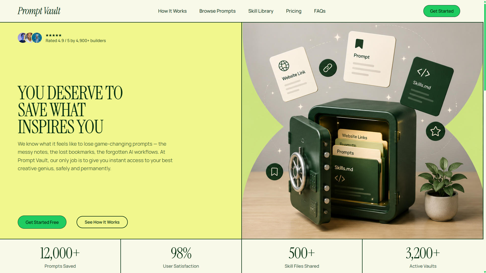

<div align="center">

# 🗄️ Prompt Vault

### *Save What Inspires You — The Ultimate Neo-Brutalist Sanctuary for AI Prompts, Workflows & Skills*

[](https://prompt-vault-by-harsh.vercel.app/)
[](https://react.dev/)
[](https://www.typescriptlang.org/)
[](https://tailwindcss.com/)
[](https://www.framer.com/motion/)
[](https://vitejs.dev/)

<br />

<p align="center">
  <a href="https://prompt-vault-by-harsh.vercel.app/">
    
  </a>
</p>

<p align="center">
  <strong>Prompt Vault</strong> is an editorial Neo-Brutalist web application crafted for developers, creators, and AI practitioners. It provides a seamless, unified sanctuary to curate, search, organize, copy, and export high-impact AI prompts, web bookmarks, and agentic <code>skill.md</code> workflows.
</p>

[**Explore Live Demo ↗**](https://prompt-vault-by-harsh.vercel.app/) • [**Report Bug**](https://github.com/panduthegang/Prompt-Vault/issues) • [**Request Feature**](https://github.com/panduthegang/Prompt-Vault/issues)

</div>

---

## ✨ Core Highlights & Features

### 🗃️ Vault Library (`/vault`)
- **Multi-Type Artifact Management**: Organize items across **AI Prompts**, **Agent Skill Rules** (`skill.md`), and **Website Documentation Bookmarks**.
- **Instant Client-Side Markdown Export (`Download .md`)**: One-click download button on Skill cards that converts prompt rules into clean `.md` files with sanitized kebab-case slugs (`<title>.md`).
- **Universal Community Publishing**: Toggle any prompt, skill, or website link to community status (`isPublished`) with active Vault Green badges and pulsing **`Live`** status indicators.
- **Sleek 3-Dots Action Menu (`•••`)**: Decluttered card action trays featuring primary actions (`Download .md`, `Copy`) alongside a floating Neo-Brutalist menu housing Publish, Edit, and Delete actions with auto-dismiss on outside click or Escape.
- **Real-time Search & Category Filtering**: Instant debounced full-text search across titles, instructions, and target tools, with pill filters for 9 categories.
- **1-Click Copy with Dynamic Toast Feedback**: Copy prompts or website URLs instantly with animated top-center toast notifications featuring hover-to-pause and timeout indicators.

### 📱 Responsive Mobile Gestures & Viewport Safeguards
- **Single-Line Invariance Across Viewports**: Enforced `whitespace-nowrap shrink-0` across buttons, icons, and timestamps to eliminate awkward word-wrapping on narrow mobile screens (e.g. 360px Android devices).
- **Flexbox Compression Protection**: Form toggle switches use `shrink-0` and `min-w-0 flex-1` label containers, preventing pill distortion across all device aspect ratios.
- **Draggable Mobile Bottom Sheets**: On mobile viewports (`< 768px`), modal dialogs adapt into smooth, gesture-driven bottom sheets with dedicated grab handles, spring physics (`damping: 28, stiffness: 300`), and swipe-down dismissal via `useDragControls`.
- **Zero Double-Scroll Mobile Selects**: In-flow option expansion on mobile screens displays all categories and tool options without nested scrollbar collisions.
- **Contextual Mobile Floating Dock**: Quick-access bottom dock with navigation buttons and a prominent **`+ Add to Vault`** trigger.

### 🧩 Clean Modular Architecture (Responsibility-Based Splitting)
- **Domain-Decoupled Component Folders**:
  - `Dashboard-Page/`: KPI metrics, saved prompts gallery, and community snapshots table.
  - `Settings-Page/`: User profile management, preset avatar selectors, and security password reset forms.
  - `Prompts-Page/`: Public curated catalog, terminal prompt cards, and locked teaser states.
  - `Privacy-Page/` & `Terms-Page/`: Structured pillars, sticky quick-index sidebars, and interactive clause drawers.
- **Database-Ready Data Models**: Centralized data modules (`dashboardData.ts`, `settingsData.ts`, `promptsData.ts`) ready for immediate plug-and-play Supabase or PostgreSQL integration.
- **Ultra-Clean Page Orchestrators**: Page files (`Dashboard.tsx`, `Settings.tsx`, `Terms.tsx`, `Privacy.tsx`) act as lightweight orchestrators (~40–190 lines).

### 🎨 Neo-Brutalist Design System
- **Signature Aesthetics**: 2px high-contrast solid borders (`border-vault-dark`), bold drop shadows, rounded pill containers (`rounded-full`, `rounded-[28px]`), and curated color palettes (`#F1F78C` Vault Yellow, `#F8F9E9` Vault Cream, `#1ECC62` Vault Green, `#002D0F` Forest Dark).
- **Impactful Typography**: Google Fonts **Instrument Serif** for editorial headlines and **Manrope** for crisp, readable UI text and code blocks.
- **Two-Tone Expanding Buttons**: Layered primary CTA pill buttons with tucked overlap capsules (`-ml-6` to `-ml-7`, `pl-7` to `pl-8`) and spring physics.

---

## 🎨 Design System Tokens

| Token | Hex Code | Role & Usage |
| :--- | :--- | :--- |
| `--color-vault-yellow` | `#F1F78C` | Hero highlights, active tab badges, tooltip tags, accent buttons |
| `--color-vault-cream` | `#F8F9E9` | Global canvas background, card body surfaces, navigation background |
| `--color-vault-green` | `#1ECC62` | Primary brand CTA buttons, active state indicators, scrollbar thumb, stat highlights |
| `--color-vault-dark` | `#002D0F` | Deep forest green for borders, primary text, wordmark, and footer surface |
| `--color-vault-darker` | `#012F12` | Darker capsule tone used in expanding button hover states |

---

## 🛠️ Technology Stack

- **Framework**: [React 18](https://react.dev/) + [TypeScript](https://www.typescriptlang.org/)
- **Routing**: [React Router DOM v7](https://reactrouter.com/)
- **Styling**: [Tailwind CSS v4](https://tailwindcss.com/) with `@tailwindcss/vite`
- **Animations & Gestures**: [Framer Motion](https://www.framer.com/motion/) (Spring physics, draggable controls, bottom sheets)
- **Bundler & Dev Server**: [Vite](https://vitejs.dev/)
- **Iconography**: [Lucide React](https://lucide.dev/)
- **Typography**: [Google Fonts](https://fonts.google.com/) (*Instrument Serif* & *Manrope*)
- **Analytics & Hosting**: [Vercel](https://vercel.com/) with SPA rewrite configuration (`vercel.json`)

---

## 📁 Project Architecture

```
Prompt-Vault/
├── public/
│   ├── avatars/                          # Default user profile avatar SVGs
│   ├── Hero.png                          # Visual artwork panel used in Hero section
│   ├── Thumbnail.png                     # Full-resolution OpenGraph social preview banner
│   └── Thumbnail.jpg                     # Compressed OpenGraph thumbnail
├── src/
│   ├── components/
│   │   ├── Landing-Page/                 # Marketing landing page domain components
│   │   │   ├── Hero.tsx                  # Centered editorial hero section with CTAs
│   │   │   ├── Stats.tsx                 # 4-column metric statistics showcase
│   │   │   ├── Process.tsx               # 12-column process & feature step grid
│   │   │   ├── Comparison.tsx            # Chaos in Notion vs. Order in the Vault
│   │   │   └── FAQ.tsx                   # Interactive FAQ accordion with animated eye
│   │   ├── Dashboard-Page/               # Dashboard domain components
│   │   │   ├── dashboardData.ts          # PromptItem, CommunityItem types & datasets
│   │   │   ├── DashboardHeader.tsx       # Welcome greeting, notifications & avatar
│   │   │   ├── DashboardStats.tsx        # 4 KPI metric summary cards
│   │   │   ├── DashboardPrompts.tsx      # Saved prompts gallery with category filters
│   │   │   └── DashboardCommunityTable.tsx # Community published snapshots table
│   │   ├── Vault-Page/                   # Vault Library modular components
│   │   │   ├── vaultData.ts              # VaultItem, VaultItemType models, presets & localStorage helpers
│   │   │   ├── VaultHeader.tsx           # Title, count badge & "+ Add to Vault" button
│   │   │   ├── VaultFilters.tsx          # 5 filter tabs (all, prompt, skill, website, starred), search & pills
│   │   │   ├── VaultCard.tsx             # Responsive card with header badges, code preview, action tray & menu
│   │   │   ├── VaultModalSheet.tsx       # Desktop modal + mobile draggable bottom sheet (useDragControls)
│   │   │   └── VaultDeleteDialog.tsx     # Neo-Brutalist confirmation modal for item deletion
│   │   ├── Settings-Page/                # Settings domain components
│   │   │   ├── settingsData.ts           # UserProfile, PresetAvatar types & defaults
│   │   │   ├── SettingsHeader.tsx        # Title, @username live badge & section tabs
│   │   │   ├── SettingsProfileSection.tsx # Profile display card & interactive edit form
│   │   │   └── SettingsSecuritySection.tsx # Password reset form with eye toggles & validation
│   │   ├── Prompts-Page/                 # Public Prompts gallery domain components
│   │   │   ├── promptsData.ts            # Prompts catalog, model badge styles & metrics
│   │   │   ├── PromptHero.tsx            # Header & catalog introduction
│   │   │   ├── PromptsGrid.tsx           # Responsive prompts cards grid layout
│   │   │   ├── PromptCard.tsx            # Terminal-style code card with 1-click copy
│   │   │   └── PromptsCurveLock.tsx      # Locked vault blur teaser with unlock CTA
│   │   ├── Privacy-Page/                 # Privacy Policy domain components
│   │   │   ├── privacyData.ts            # PrivacySection data models & principles
│   │   │   ├── PrivacySubHeader.tsx      # Breadcrumbs & document switcher
│   │   │   ├── PrivacyHero.tsx           # Title, lead narrative & creator meta card
│   │   │   ├── PrivacyPillars.tsx        # 4 Core Privacy Pillars matrix
│   │   │   ├── PrivacyContent.tsx        # 2-column sidebar navigation & accordions
│   │   │   ├── PrivacySectionCard.tsx    # Interactive expandable policy drawer
│   │   │   ├── PrivacySidebar.tsx        # Quick Index table of contents & creator card
│   │   │   └── PrivacyCTA.tsx            # Community banner with expanding pill buttons
│   │   ├── Terms-Page/                   # Terms & Conditions domain components
│   │   │   ├── termsData.ts              # TermsClause data models & metrics
│   │   │   ├── TermsSubHeader.tsx        # Breadcrumbs & document switcher
│   │   │   ├── TermsHero.tsx             # Title, lead narrative & agreement meta card
│   │   │   ├── TermsPillars.tsx          # 4 Pillars of Fair Use matrix
│   │   │   ├── TermsContent.tsx          # 2-column sidebar navigation & accordions
│   │   │   ├── TermsClauseCard.tsx       # Interactive expandable clause drawer
│   │   │   ├── TermsSidebar.tsx          # Quick Index table of contents & creator card
│   │   │   └── TermsCTA.tsx              # Community banner with expanding pill buttons
│   │   ├── ui/                           # Reusable design system primitives
│   │   │   ├── Select.tsx                # Bespoke Neo-Brutalist select with mobile expansion
│   │   │   └── Toast.tsx                 # Floating dynamic toast notification system
│   │   ├── Navbar.tsx                    # Sticky top navigation with mobile drawer
│   │   ├── Sidebar.tsx                   # Collapsible desktop sidebar & mobile dock
│   │   └── Footer.tsx                    # Footer with link grids, watermark & attribution
│   ├── pages/
│   │   ├── static-pages/                 # Marketing & legal page orchestrators
│   │   │   ├── LandingPage.tsx           # Marketing landing page orchestrator
│   │   │   ├── NotFound.tsx              # Editorial Neo-Brutalist 404 page
│   │   │   ├── Privacy.tsx               # Creator Privacy Policy orchestrator
│   │   │   └── Terms.tsx                 # Terms & Conditions orchestrator
│   │   ├── Prompts.tsx                   # Public curated prompt catalog orchestrator
│   │   ├── Vault.tsx                     # Main Vault library (search, filter, CRUD, sheets)
│   │   ├── Dashboard.tsx                 # User workspace overview orchestrator
│   │   ├── Settings.tsx                  # Profile management & security orchestrator
│   │   ├── Signin.tsx                    # Neo-Brutalist authentication sign-in view
│   │   └── Signup.tsx                    # Account registration view
│   ├── utils/
│   │   └── clipboard.ts                  # Async clipboard copy helper with fallbacks
│   ├── App.tsx                           # Top-level client router and route definitions
│   ├── main.tsx                          # React DOM entry point
│   └── index.css                         # Tailwind v4 theme variables & custom scrollbars
├── index.html                            # HTML5 entry with preconnected Google Fonts
├── vercel.json                           # Vercel SPA routing rewrites
├── package.json                          # Dependencies, scripts, and build configuration
├── vite.config.ts                        # Vite build pipeline and plugin configuration
├── DESIGN.md                             # Design tokens, typography & interaction rules
├── CONTEXT.md                            # Architecture & project context
└── MEMORY.md                             # Agent memory, decisions & changelog
```

---

## 🚀 Getting Started

### Prerequisites

- [Node.js](https://nodejs.org/) (`v18.0` or higher recommended)
- `npm`, `pnpm`, `yarn`, or `bun`

### Installation & Local Setup

1. **Clone the repository:**
   ```bash
   git clone https://github.com/panduthegang/Prompt-Vault.git
   cd Prompt-Vault
   ```

2. **Install dependencies:**
   ```bash
   npm install
   ```

3. **Start the development server:**
   ```bash
   npm run dev
   ```

4. **Access the application:**
   Open [http://localhost:5173](http://localhost:5173) in your browser.

### Production Build

To test or generate the production bundle:

```bash
npm run build
npm run preview
```

---

## 🚢 Deployment

The project is configured for continuous zero-config deployment on [Vercel](https://vercel.com/):

1. Connect your repository to Vercel.
2. The included [`vercel.json`](file:///c:/Users/Lenovo/Documents/Prompt-Vault/vercel.json) automatically directs all SPA routes to `index.html`.
3. Production builds run `vite build` and serve from the `dist/` directory.

---

## 👨‍💻 Author

Crafted with care by **Harsh Rathod**

- **Portfolio**: [harshrathod-portfolio.vercel.app](https://harshrathod-portfolio.vercel.app/)
- **Live Demo**: [prompt-vault-by-harsh.vercel.app](https://prompt-vault-by-harsh.vercel.app/)
- **GitHub**: [@panduthegang](https://github.com/panduthegang)

---

## 📄 License

This project is open-source and available under the [MIT License](LICENSE).
